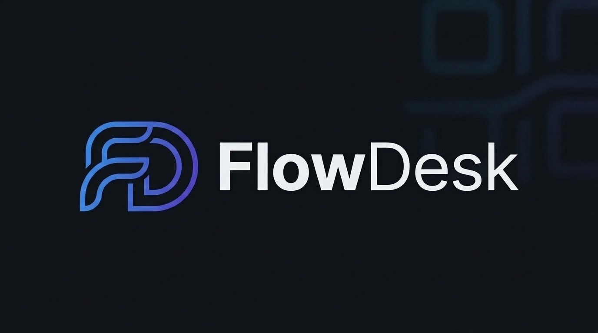
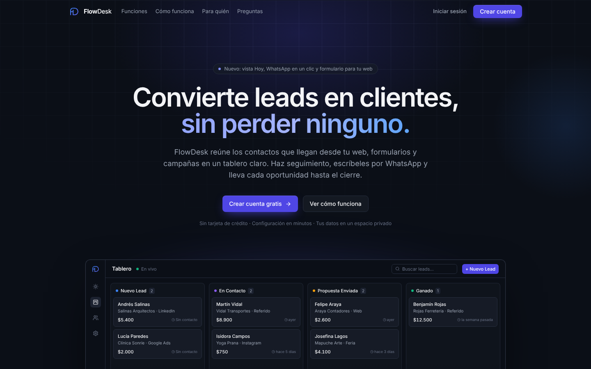
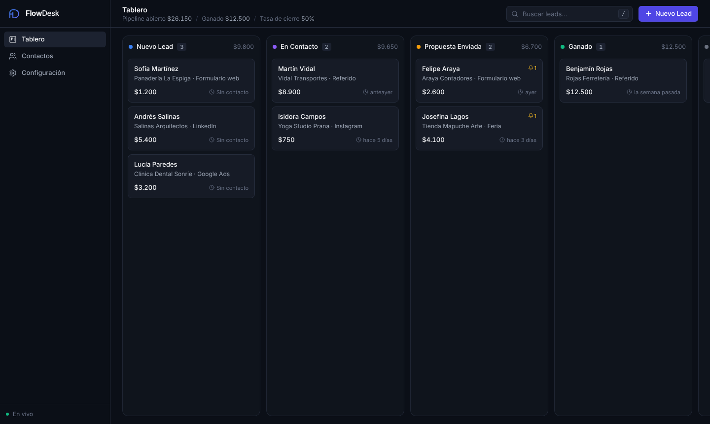
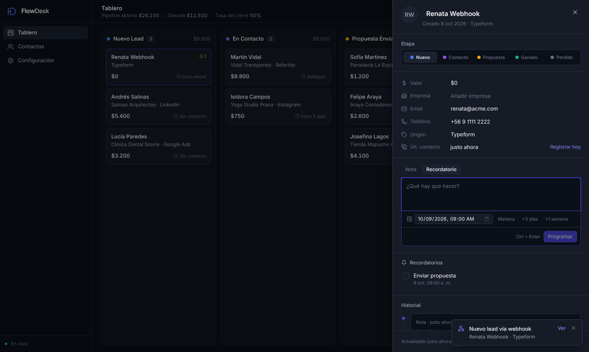
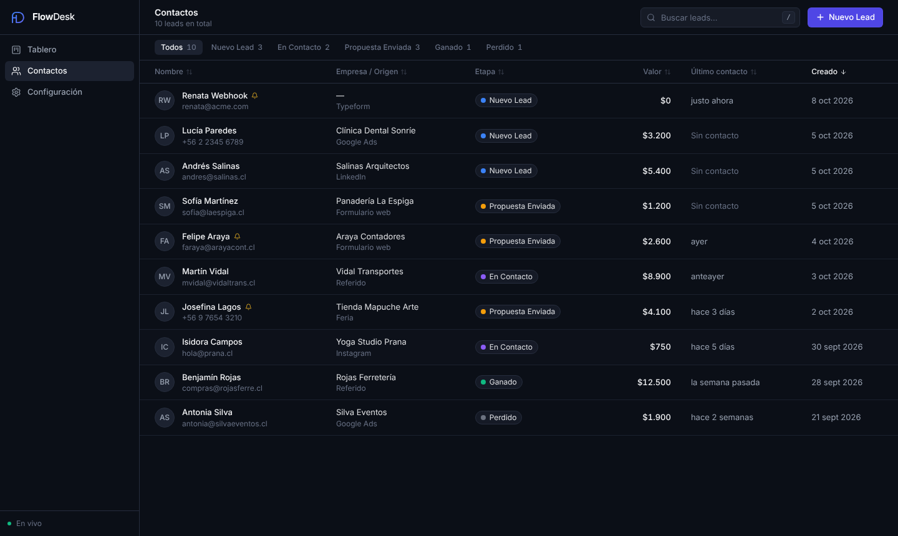

<p align="center"></p>

# FlowDesk

CRM ligero tipo Kanban para que emprendedores y equipos pequeños gestionen sus leads entrantes:
tablero con drag & drop, ficha lateral con notas y recordatorios, y un webhook que inserta
leads en tiempo real (Socket.io) sin refrescar la página. Incluye página de inicio pública e inicio de sesión
con cuentas para el equipo.





| Ficha del lead | Contactos |
| --- | --- |
|  |  |

## Stack

| Capa | Tecnología |
| --- | --- |
| Frontend | React 18 + TypeScript, Vite, Tailwind CSS, `@dnd-kit`, Lucide Icons |
| Backend | Node.js 20+, Express 5, Socket.io, Zod |
| Base de datos | PostgreSQL 14+ (local, Supabase, Neon o Replit Postgres) |

```
FlowDesk/
├── vercel.json           # Vercel Services: cliente (Vite) + servidor (Express)
├── server/src
│   ├── app.js            # App Express (export default: entrada en Vercel)
│   ├── index.js          # Servidor HTTP + Socket.io para despliegues tradicionales
│   ├── schema.js         # Esquema idempotente (se aplica al arrancar o en la primera petición)
│   ├── services/leads.js # Lógica de leads/notas + emisión de eventos en tiempo real
│   ├── services/auth.js  # Contraseñas (scrypt), sesiones y rate limiting
│   ├── routes/           # /api/auth, /api/users, /api/leads, /api/notes, /api/webhooks
│   └── seed.js           # Datos de demostración
└── client/src
    ├── store/AppStore.tsx   # Estado global + suscripción al socket
    ├── auth/                # Sesión del usuario y rutas protegidas
    ├── views/               # Inicio, Login/Registro, Tablero, Contactos, Configuración
    └── components/          # Sidebar, Header, Slide-over, Modal, Toasts
```

## Puesta en marcha

Requisitos: Node.js 20.12+ y una base PostgreSQL.

```bash
cp .env.example .env              # ajusta DATABASE_URL
docker compose up -d              # opcional: Postgres local en :5432
npm install
npm run db:seed -- tu@empresa.cl  # opcional: 9 leads de ejemplo en el espacio de esa cuenta (reemplaza sus leads)
npm run dev                       # API en :3001, frontend en http://localhost:5173
```

Abre `http://localhost:5173` y pulsa **Crear cuenta gratis**. La primera cuenta de la instalación es administradora
de la plataforma. El tablero vive en `/app` y el panel de administración en `/app/admin`.

El esquema se crea automáticamente al iniciar el servidor (`npm run db:migrate` lo aplica a mano).

**Producción** (un único proceso sirve API, WebSocket y frontend):

```bash
npm run build && npm start        # http://localhost:3001
```

### Despliegue en Vercel

`vercel.json` usa [Vercel Services](https://vercel.com/docs/services): el servicio `client` compila el
frontend con Vite (con fallback SPA a `index.html`) y el servicio `server` ejecuta la app Express
(`server/src/app.js`) como función. `/api/*` va al servidor con su ruta original y todo lo demás al cliente.

1. En [vercel.com/new](https://vercel.com/new) importa el repositorio. No cambies nada de build: cada servicio
   ya define su framework y su raíz.
2. En el proyecto, **Storage → Create Database → Neon** (Postgres). La integración inyecta `DATABASE_URL`
   automáticamente. Con Supabase, copia su cadena de conexión *pooler* en `DATABASE_URL`.
3. Opcional: agrega `ADMIN_EMAILS` en **Settings → Environment Variables** con tu correo.
4. Despliega, abre la URL y pulsa **Crear cuenta gratis**. Las tablas se crean (y migran) solas en la primera petición.

Con la CLI: `npx vercel link`, `npx vercel env add DATABASE_URL` y `npx vercel deploy --prod`.

Diferencias en Vercel (serverless):

- Vercel no mantiene conexiones WebSocket, así que el tiempo real usa **sondeo cada 3 s** sobre una tabla
  `events` en Postgres (solo mientras la pestaña está visible). En servidores normales se sigue usando Socket.io.
- El límite de intentos de inicio de sesión vive en memoria de cada instancia, por lo que es menos estricto.

**Supabase / Neon / Replit**: usa la cadena de conexión del proveedor en `DATABASE_URL`. Si no incluye
`sslmode=require`, define `PGSSL=true`. En Replit, el archivo `.replit` ya trae los comandos de build y run.

### Variables de entorno

| Variable | Descripción |
| --- | --- |
| `DATABASE_URL` | Cadena de conexión PostgreSQL |
| `PGSSL` | `true` para forzar TLS |
| `PORT` | Puerto del servidor (por defecto `3001`) |
| `ADMIN_EMAILS` | Correos separados por coma que siempre son administradores de la plataforma |
| `CORS_ORIGIN` | Orígenes permitidos para Socket.io, separados por coma |
| `NODE_ENV` | `production` marca la cookie de sesión como `Secure` |
| `TRUST_PROXY` | Proxies de confianza para `X-Forwarded-*` (por defecto, solo redes privadas) |
| `REALTIME_MODE` | `socket` o `poll`; por defecto `poll` en Vercel y `socket` en el resto |

## Cuentas, espacios y administración

| Ruta | Contenido |
| --- | --- |
| `/` | Página de inicio: qué es FlowDesk, para quién es y cómo funciona |
| `/registro` | Registro: nombre, correo de empresa, teléfono, rol en la empresa y contraseña |
| `/bienvenida` | Encuesta obligatoria tras registrarse: cómo conoció FlowDesk, tamaño y rubro de la empresa |
| `/login` | Inicio de sesión |
| `/app`, `/app/contactos`, `/app/configuracion` | La aplicación; requiere sesión |
| `/app/admin` | Panel de administración de la plataforma (solo administradores) |

- **Un espacio por cuenta.** Cada registro crea un espacio de trabajo aislado (leads, equipo, webhook y tiempo real).
  El dueño agrega a su equipo en **Configuración → Equipo**; esos miembros no responden la encuesta.
- **Administradores.** La primera cuenta de la instalación y los correos de `ADMIN_EMAILS` son administradores. El panel
  muestra métricas, los resultados de la encuesta y todas las cuentas, y permite: editar nombre, correo, teléfono y rol;
  suspender (con motivo visible para el usuario) y reactivar; restablecer la contraseña; cerrar sus sesiones; dar o
  quitar permisos de administrador; y eliminar la cuenta (si es dueña, se elimina su espacio completo). Cada acción
  queda en un historial de auditoría. Un administrador no puede suspenderse, quitarse permisos ni eliminarse a sí mismo.
- **Seguridad.** Contraseñas con `scrypt`; sesión en cookie `httpOnly` + `SameSite=Lax` de 30 días (en la base solo se
  guarda el hash SHA-256 del token). Login limitado a 8 intentos por email y 40 por IP cada 15 min; registros, a 10 por
  IP por hora. Suspender, restablecer la contraseña o eliminar una cuenta la desconecta al instante.
- Toda la API y el tiempo real exigen sesión, excepto `POST /api/webhooks/lead`, que se autentica con la clave del espacio.

## Webhook de leads

Cada espacio tiene su propia clave (en **Configuración → Webhook de entrada**, donde también se puede regenerar):

```bash
curl -X POST https://tu-app.vercel.app/api/webhooks/lead \
  -H "Content-Type: application/json" \
  -H "X-Webhook-Key: <clave-del-espacio>" \
  -d '{"name":"María González","email":"maria@empresa.com","phone":"+56 9 1234 5678","source":"Formulario web","notes":"Solicita una demo"}'
```

- La clave también puede ir en la URL: `/api/webhooks/lead?key=<clave>` (útil en Zapier, Make o formularios).
- `name` es obligatorio; `email`, `phone`, `source`, `notes` son opcionales (también acepta `company` y `value`).
- Acepta `application/json` y `application/x-www-form-urlencoded`.
- Respuestas: `201 { ok, lead }`, `401` clave inválida, `422` con el detalle de validación.
- El lead entra al tope de **Nuevo Lead** del espacio, `notes` se guarda como primera nota y los tableros abiertos lo
  reciben al instante. Cada solicitud queda en **Configuración → Actividad del webhook**.

## API

| Método | Ruta | Descripción |
| --- | --- | --- |
| `POST` | `/api/auth/register` | `{ name, email, phone, job_title, password }` — crea la cuenta y su espacio |
| `POST` | `/api/auth/login` · `/api/auth/logout` | Inicio y cierre de sesión |
| `POST` | `/api/auth/onboarding` | `{ heard_from, heard_from_detail?, company_size, company_about }` — encuesta |
| `GET` | `/api/auth/me` | Usuario actual (`null` si no hay sesión) |
| `POST` | `/api/auth/password` | `{ current, next }` — cambiar contraseña |
| `GET` / `POST` / `DELETE` | `/api/users[/:id]` | Equipo (crear y quitar: solo propietario) |
| `GET` | `/api/leads` | Todos los leads (con `pending_reminders`) |
| `POST` | `/api/leads` | Crear lead |
| `PATCH` | `/api/leads/:id` | Editar campos (`name`, `email`, `phone`, `company`, `source`, `value`, `last_contact_at`) |
| `POST` | `/api/leads/:id/move` | `{ status, beforeId }` — cambia de etapa y posición |
| `DELETE` | `/api/leads/:id` | Eliminar lead |
| `GET` / `POST` | `/api/leads/:id/notes` | Historial / nueva nota o recordatorio (`{ kind, body, dueAt }`) |
| `PATCH` / `DELETE` | `/api/notes/:id` | Marcar recordatorio (`{ done }`) / eliminar |
| `GET` | `/api/webhooks/events` | Últimas 25 solicitudes del webhook del espacio |
| `GET` / `POST` | `/api/webhooks/config` · `/api/webhooks/rotate` | Clave del webhook / regenerarla (propietario) |
| `GET` | `/api/admin/stats` · `/api/admin/users?q=&filter=` | Métricas y cuentas (solo administradores) |
| `GET` / `PATCH` / `DELETE` | `/api/admin/users/:id` | Detalle con historial / editar datos / eliminar |
| `POST` | `/api/admin/users/:id/{ban,unban,password,logout,admin}` | Acciones de administración |

Eventos de tiempo real (por Socket.io o, en modo sondeo, vía `GET /api/events?after=<id>`): `lead:created`, `lead:updated`, `lead:deleted`, `leads:reordered`,
`note:created`, `note:updated`, `note:deleted`.

## Atajos de teclado

| Tecla | Acción |
| --- | --- |
| `/` o `Ctrl/⌘ K` | Buscar |
| `N` | Nuevo lead |
| `Esc` | Cerrar panel o modal |
| `Ctrl/⌘ Enter` | Guardar nota |
| `Enter` / `Espacio` sobre una tarjeta | Abrir ficha / mover con flechas |

## Notas

- Agregar una nota actualiza la fecha de **último contacto**; también se puede registrar con «Registrar hoy».
- Los cambios de etapa quedan en el historial del lead.
- En producción sirve la app detrás de HTTPS. Las bases existentes se migran solas al nuevo modelo de espacios
  (los datos previos quedan en un espacio «Mi espacio» y la cuenta más antigua pasa a ser administradora).
